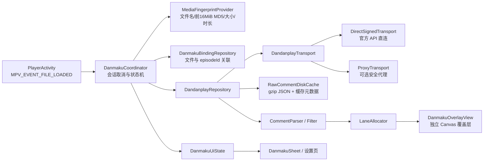

# mpv-ex 接入弹弹play开放弹幕网络方案

> 方案状态：可实施设计稿  
> 调研日期：2026-08-07  
> 适用代码基线：mpvExtended `4151a45`（Android / Kotlin / libmpv）

## 1. 结论

**可行，建议实施。** mpv-ex 现有技术栈已经具备所需能力：OkHttp、kotlinx.serialization、Koin、Room、Compose 控制层、libmpv 事件回调以及本地/SAF/网络媒体入口均已存在，不需要替换播放器内核，也不需要新增重量级网络框架。

建议分两期交付：

1. **首期只读 MVP**：文件自动识别、手动搜索/纠错、获取弹幕、弹幕渲染、缓存、过滤、时间偏移和离线降级。
2. **后续可选写入**：在应用获批“社区合作”或“商业授权”层级后，接入应用私有弹幕库的发送/删除能力。

主要约束不在技术，而在凭证、额度和合规：

- 所有 API 请求都需要应用级 `AppId/AppSecret` 鉴权；“公开接口”仅表示不需要用户 JWT。
- 2026-06-25 起已经启用应用分层和日/月额度。
- 开源客户端无法真正保密内置 `AppSecret`；直连模式可用于首版，但发布前必须与弹弹play确认接入层级和凭证使用方式。
- 未经授权不得商用；需要在 README、关于页和相关 UI 中使用全名“弹弹play开放弹幕网络”或“弹弹play”，并注明来源和官网。
- 弹幕发送接口虽然已于 2026-07-01 上线，但基础/普通开源层仅有测试额度；完整额度当前面向社区合作与商业授权项目。

### 可行性评分

| 维度 | 结论 | 说明 |
| --- | --- | --- |
| API 能力 | 高 | 匹配、搜索、拉取、发送均有 v2 API |
| mpv-ex 适配度 | 高 | 已有网络、序列化、DI、数据库和播放器事件基础 |
| 本地文件自动匹配 | 高 | 可按规范读取前 16 MiB 并计算 MD5 |
| 网络流自动匹配 | 中 | 多数流无法可靠取得大小/前 16 MiB，只能文件名匹配或手选 |
| 弹幕渲染 | 高 | 独立 Canvas 覆盖层不会占用 mpv 字幕轨 |
| 凭证安全 | 中 | 客户端密钥可被逆向；强保密需要服务端代理 |
| 运营/合规 | 中 | 需要项目审核、额度管理、来源标注和非商业约束 |

## 2. 目标和非目标

### 2.1 首期目标

- 用户主动启用功能后，在播放本地视频时后台完成弹幕库匹配。
- 精确匹配自动加载；模糊匹配只提示用户选择，不打断播放。
- 匹配失败时支持按作品名、集数或 TMDB ID 手动搜索。
- 拉取官方、第三方关联及本应用弹幕，默认使用 `withRelated=true`。
- 支持滚动、顶部、底部三类弹幕，并正确应用服务器返回的 `shift`。
- 支持暂停、跳转、倍速、切集、横竖屏、后台恢复；不影响主字幕和副字幕。
- 支持离线缓存、过期缓存兜底、关键词过滤、透明度、字号、速度、密度、显示区域和时间偏移。
- 整个流程不阻塞视频首帧，不在主线程进行网络访问或 16 MiB 哈希计算。

### 2.2 首期非目标

- 不批量预取整季或整个媒体库弹幕。
- 不做“弹幕下载器”或数据库导出功能。
- 不在未获完整额度前开放正式发送弹幕。
- 不把弹幕转换为 mpv ASS 字幕轨作为主运行方案。
- 不为无法读取内容的直播/HLS 流承诺精确自动匹配。

## 3. 官方接口和约束

### 3.1 鉴权

API 根地址为 `https://api.dandanplay.net`。客户端采用官方推荐的签名验证模式，请求头为：

```text
X-AppId: <app-id>
X-Timestamp: <当前 UTC Unix 秒>
X-Signature: base64(sha256(AppId + Timestamp + Path + AppSecret))
```

签名中的 `Path`：

- 以 `/` 开头；
- 不含协议、域名和查询参数；
- 保持与实际请求路径一致，建议使用小写路径；
- 拼接内容使用 UTF-8，SHA-256 结果按原始二进制做 Base64，不是对十六进制字符串做 Base64。

客户端必须校准系统时间。收到 `403` 时读取 `X-Error-Message`，区分 `Invalid Timestamp`、`Invalid AppId`、`Invalid Signature` 等原因。

### 3.2 首期接口映射

| 场景 | 接口 | 关键输入 | 关键输出/注意事项 |
| --- | --- | --- | --- |
| 自动匹配 | `POST /api/v2/match` | `fileName`、`fileHash`、`fileSize`、`videoDuration`、`matchMode` | `isMatched`、候选列表、`episodeId`、`shift` |
| 手动搜索 | `GET /api/v2/search/episodes` | `anime` 或 `tmdbId` 至少一个；可带 `episode`、`v2=true` | 作品及剧集列表；`hasMore=true` 时提示缩小范围 |
| 获取弹幕 | `GET /api/v2/comment/{episodeId}` | `withRelated=true`、`chConvert=0/1/2`、可选 `from` | 官方描述为 302 跳转到加速服务，客户端最终解析 `CommentResponseV2` |
| 发送弹幕（后续） | `POST /api/v2/comment/{episodeId}/app` | `time`、`mode`、`color`、`comment`、`userName` | 应用私有弹幕库；完整额度有层级限制 |
| 删除应用弹幕（后续） | `DELETE /api/v2/comment/app/{episodeId}/{cid}` | `episodeId`、`cid` | 仅作为发送能力的配套功能实现 |

自动匹配请求示例：

```json
{
  "fileName": "葬送的芙莉莲 S01E01",
  "fileHash": "658d05841b9476ccc7420b3f0bb21c3b",
  "fileSize": 734003200,
  "videoDuration": 1462,
  "matchMode": "hashAndFileName"
}
```

字段规则：

- `fileName` 不含目录和扩展名。
- `fileHash` 是文件前 `16 * 1024 * 1024` 字节的 32 位 MD5；小于 16 MiB 的文件对实际可读内容计算。
- `fileSize` 单位为字节，`videoDuration` 单位为整秒。
- `matchMode` 可为 `hashAndFileName`、`fileNameOnly`、`hashOnly`。
- 只有 `isMatched=true` 且候选唯一时才自动采用结果；模糊结果即使只有一个，也应让用户确认。

弹幕响应中单条数据为：

```json
{
  "cid": 123456,
  "p": "12.34,1,16777215,10001",
  "m": "示例弹幕"
}
```

`p` 依次表示出现时间（秒）、模式、十进制 RGB 颜色和用户 ID。颜色按 `0xRRGGBB` 解释，最终补 `0xFF` alpha。

### 3.3 必须专门验证的文档差异

当前官方 Swagger 对模式 `4/5` 的文字描述存在矛盾：获取弹幕接口说明写作 `4=底部、5=顶部`，发送请求模型说明写作 `4=顶部、5=底部`。首版解析建议遵循获取接口说明及通行格式，即：

- `1`：右向左滚动；
- `4`：底部固定；
- `5`：顶部固定。

在发布前用测试弹幕做契约测试；若实际服务结果不同，只调整 API 到领域模型的映射，渲染层不感知服务端编号。

颜色计算说明也有一处文字差异：获取接口按标准 RGB 写作 `R*256*256 + G*256 + B`，发送请求模型写作 `R*255*255 + G*255 + B`。后者无法形成标准 `0xRRGGBB`，实现应采用 256 进位算法，并用红、绿、蓝、白四个固定颜色做发送/回读契约测试。

### 3.4 配额和使用方式

- 只能随用户的实际播放、手动搜索或刷新动作调用 API。
- 禁止整库抓取、批量下载、整季预热和无意义请求。
- 官方建议缓存 2–6 小时；热门更新日可为 30–60 分钟，普通内容 12–24 小时，老内容 2–7 天。
- 超出日/月额度后会被限制到额度重置或层级升级。
- mpv-ex 是免费开源且无广告的播放器，原则上适合申请“开源（非商业）层”；多平台播放器/媒体中心集成也属于官方列举的“社区合作层”候选。README 中存在捐赠入口，项目方仍应在申请时主动说明，并以官方书面认定为准。

## 4. mpv-ex 现状与接入点

当前工程已有以下基础：

- `app/build.gradle.kts` 已引入 OkHttp、kotlinx.serialization、Koin 和 Room。
- `DomainModule.kt` 已提供共享 `OkHttpClient`，可新增专用的弹弹play客户端或从共享客户端派生。
- `PlayerActivity.handleFileLoaded()` 在 `MPV_EVENT_FILE_LOADED` 后运行，是启动当前媒体匹配任务的正确入口。
- `PlayerViewModel` 已持有 `time-pos`、`duration` 和高精度位置流，并已有在线字幕搜索的异步状态模式。
- `player_layout.xml` 当前层次为 `MPVView` + 全屏 `ComposeView` 控制层，可在两者之间加入独立弹幕覆盖层。
- `Sheets`、`PlayerSheets` 和可定制 `PlayerButton` 已形成统一的播放器功能入口。
- `MediaInfoParser` 已能从文件名提取标题、季、集、年份；在线字幕页已有 TMDB 搜索/选季/选集流程，可复用交互经验。
- Room 当前声明为版本 8，但代码中已经定义尚未启用的 `MIGRATION_8_9`；新增弹幕表时应将它扩展为真正的 8→9 迁移并把数据库版本提升到 9。

## 5. 总体架构



### 5.1 分层职责

1. **API DTO 层**只表达 Swagger 字段，允许未知字段，负责业务错误解析。
2. **Repository 层**负责鉴权、跳转、缓存、重试、去重和 API DTO 到领域模型转换。
3. **Coordinator 层**负责一次播放会话：绑定查询、匹配、候选选择、拉取、过滤和渲染数据发布。
4. **Renderer 层**只接收标准化弹幕和渲染设置，不知道 AppId、缓存或 API 编号。
5. **UI 层**只观察 `DanmakuUiState` 并发送用户意图。

这种划分允许以后替换数据源或从直连切换到代理，而不改播放器和渲染器。

## 6. 凭证和传输方案

### 6.1 推荐落地方式

定义统一接口：

```kotlin
interface DandanplayTransport {
  suspend fun match(request: MatchRequest): MatchResponse
  suspend fun searchEpisodes(query: EpisodeSearchQuery): SearchEpisodesResponse
  suspend fun getComments(query: CommentQuery): CommentResponse
}
```

首期实现 `DirectSignedTransport`，同时保持可替换为 `ProxyTransport`：

- `AppId/AppSecret` 不进入 Git 仓库。
- 通过本机 `local.properties` 和 CI secret 注入不同 distribution flavor 的 BuildConfig 或生成资源。
- 使用签名验证模式，不在请求中直接发送 `X-AppSecret`。
- Release 开启的 R8 只能提高提取成本，不能承诺密钥绝对安全。
- 为 standard、playstore、fdroid/preview 使用独立凭证和额度，便于撤销、轮换和定位滥用。
- 官方构建不提供明文查看密钥的 UI；开发/自编译构建可提供高级 BYOK 配置，凭证使用 Android Keystore 加密保存。

发布闸门：在 AppId 审核时向弹弹play明确说明这是开源 Android 播放器、发布渠道、预计用户量、缓存策略和直连签名方式，获得确认后再把官方凭证注入 Release。

### 6.2 何时使用代理

如果出现密钥滥用、额度难以控制、需要集中缓存，或项目方对密钥泄露零容忍，则启用全请求代理：

- 代理只开放 match/search/comment 所需的窄接口，严格校验参数、响应大小和超时。
- `AppSecret` 只在服务端保存；代理负责签名、上游缓存、速率限制和熔断。
- 不要提供“签名生成接口”，否则攻击者仍可拿签名调用任意上游接口。
- 日志不记录完整文件名、hash 或用户输入；敏感字段只做不可逆摘要。
- 客户端缓存仍保留，避免所有播放都请求代理。

代理会引入部署、隐私、SLA 和带宽成本，不应作为首期的硬依赖。

## 7. 播放到弹幕的完整流程

### 7.1 会话状态机

```text
Disabled
  └─用户启用→ ResolvingMedia
ResolvingMedia
  ├─已有绑定+有效缓存→ Ready
  ├─已有绑定+无缓存→ LoadingComments
  ├─精确匹配→ LoadingComments
  ├─模糊匹配→ NeedsSelection
  ├─无结果→ Unmatched
  └─失败→ Error / StaleReady
LoadingComments
  ├─成功有数据→ Ready
  ├─成功空列表→ Empty
  ├─失败有旧缓存→ StaleReady
  └─失败无缓存→ Error
```

每次切换视频生成新的 `playbackSessionId`，取消旧协程并清空旧渲染列表。所有异步结果回写前再次比对 session ID，防止播放列表快速切集时把上一集弹幕显示到下一集。

### 7.2 文件身份和匹配策略

#### 本地文件和可读 SAF URI

1. 播放先正常开始。
2. `Dispatchers.IO` 中读取原始媒体 URI，而不是 libmpv 的临时 `/proc/self/fd/*` 路径。
3. 读取前 16 MiB 计算 MD5；使用 `OpenableColumns.SIZE`、`AssetFileDescriptor.length` 或 `ParcelFileDescriptor.statSize` 获取大小。
4. 从 MPV `duration` 取得整秒时长。
5. 发送 `hashAndFileName` 匹配。
6. 本地稳定键使用 `SHA-256("local\0" + first16Md5 + "\0" + fileSize)`，重命名后仍能复用绑定。

读取规则：

- 输入流必须限制为 16 MiB，绝不扫描完整大文件。
- 无法取得大小时发送 `0`，但不伪造数值。
- 处理少于 16 MiB、无法 seek、权限被回收、空文件和读取中断。
- MD5 只用于遵循服务端匹配协议，不作为安全校验。

#### SMB / FTP / WebDAV

- 首期默认不为匹配额外下载 16 MiB，避免流量和首播压力。
- 使用原始网络文件名、已知大小/时长，调用 `fileNameOnly`。
- 稳定键使用连接 ID + 规范化远端路径的本地 SHA-256；不把服务器地址、账号或路径发给弹弹play。
- 用户可手动触发“深度匹配”，确认后才读取远端前 16 MiB。

#### HTTP / HLS / RTSP / 直播流

- 普通 HTTP 文件只有在支持 Range、长度可信且不是播放清单时，才允许用户主动做 hash 匹配。
- HLS、DASH、RTSP、直播和带时效签名 URL 默认只做文件名匹配或手动搜索。
- 远端 URI 只在设备内做哈希作为绑定键，不上传完整 URL、查询参数或 Referer。

### 7.3 自动选择规则

- 本地已有人工绑定：直接使用，直到用户点击“重新匹配”。
- `isMatched=true && matches.size==1`：自动绑定。
- 其他非空候选：进入 `NeedsSelection`，播放器只显示非打断式提示。
- 空结果：进入 `Unmatched`，用户可打开搜索页。
- 手选结果永久优先于后续自动结果。

绑定时保存服务端返回的 `shift`。弹幕实际时间为：

```text
displayTime = max(0, commentTime + matchShift + userOffset)
```

用户偏移按“当前文件绑定”保存，不修改服务端原始数据。

### 7.4 手动搜索

- 初始关键词来自 `MediaInfoParser.parse(fileName)` 的清洗标题和集数。
- 默认调用 `GET /api/v2/search/episodes?anime=...&episode=...&v2=true`；新版搜索引擎于 2026-07-13 上线，目前需要显式 `v2=true`。
- 若现有在线字幕流程已选中 TMDB 项，可用 `tmdbId` + `episode` 反查；电影传 `tmdbIdType=1`，电视剧为 `0`。
- 关键词少于 2 字时不发请求。
- `hasMore=true` 时提示用户补充作品名或集数，不做无限滚动式重复查询。

## 8. 弹幕获取、解析和过滤

### 8.1 网络处理

- OkHttp 保持 HTTPS，允许 302 跳转，但校验最终 URL 仍为 HTTPS。
- 读取响应前限制最大 Content-Length；流式解析或下载到临时文件后原子替换缓存。
- 对包含 `ResponseBase` 的 HTTP `200` 响应仍需检查 `success=false/errorCode/errorMessage`；弹幕加速服务返回的 `CommentResponseV2` 则直接校验 `count/comments`。
- GET 类请求对连接失败、超时和 5xx 最多重试 2 次，使用指数退避和抖动；401/403、业务错误和解析错误不重试。
- 发送弹幕 POST 不自动重试，避免重复弹幕。

### 8.2 解析规则

- `p` 最多按前 4 段解析；时间不是有限非负数、模式未知、颜色越界或正文为空时丢弃并计数。
- `m` 移除换行和不可见控制字符，按 Unicode code point 限制显示长度。
- 颜色使用 `0xFF000000 or (value and 0x00FFFFFF)`；用户透明度在绘制阶段叠加。
- `cid` 用于稳定去重；同一响应出现重复 cid 时保留首条合法记录。
- DTO 使用 `ignoreUnknownKeys=true`，API 新增字段不应导致整个列表解析失败。
- 解析统计只记录总数和错误类型，不记录正文或用户 ID。

### 8.3 过滤顺序

1. 协议合法性校验；
2. 按模式开关过滤；
3. 关键词/正则和本地屏蔽用户过滤；
4. 时间范围过滤；
5. 密度控制和同屏上限；
6. 车道分配。

密度采样必须稳定，例如按 `cid` 哈希排序后保留，确保暂停/拖动后不会随机换一批弹幕。

## 9. 渲染方案

### 9.1 为什么不用 ASS 字幕轨

将弹幕生成 ASS 再 `sub-add` 虽然实现快，但会占用 mpv 的 `sid/secondary-sid`：

- 会与普通字幕或现有双字幕功能冲突；
- 容易受 `sub-ass-override`、字幕缩放和字幕延迟设置影响；
- 很难独立开关、过滤和实时调密度；
- 无法在不重建字幕文件的情况下即时改变样式。

ASS 可以保留为调试导出功能，不作为运行时实现。

### 9.2 独立 Canvas 覆盖层

把布局改为：

```text
ConstraintLayout
├── MPVView
├── DanmakuOverlayView   ← 新增，不接收触摸
└── ComposeView controls
```

`DanmakuOverlayView` 使用自定义 `View.onDraw(Canvas)`：

- 以 MPV `time-pos` 为唯一媒体时钟；位置本身已体现暂停、跳转和倍速。
- 播放时由 `Choreographer` 驱动重绘；暂停或无可见弹幕时停止无意义刷新。
- 弹幕按时间排序，二分定位活动窗口，绘制路径不遍历全量弹幕。
- 文本宽度、Paint 和布局结果复用，绘制循环内避免对象分配。
- 先描边再填充，保证浅色/深色画面上的可读性。
- 单独处理系统安全区、圆角屏、挖孔和控制栏；默认只使用画面上方 75% 高度，保护底部字幕区。
- `binding.controls.alpha=0` 不会影响独立覆盖层；PiP 默认关闭弹幕，可提供“在 PiP 显示”高级开关。

### 9.3 轨迹和碰撞

- **滚动模式**：文字从右侧屏外进入、从左侧完全离开。生命周期由速度设置和文字宽度共同计算，避免长文本移动过快。
- **顶部/底部模式**：固定居中显示，默认 4 秒。
- 每个车道维护上一条弹幕的尾部离场条件；只有确认不会追尾或重叠时才复用。
- 所有车道繁忙时按稳定优先级丢弃，不创建重叠对象。
- 默认手机同屏上限 60，平板 100；用户的“密度”调整采样比例而不是无上限增加对象。
- 横竖屏变化时重新计算车道，但领域弹幕列表和媒体时间不变。

## 10. 缓存和持久化

### 10.1 文件—弹幕库绑定

新增 `DanmakuMediaBindingEntity`：

| 字段 | 用途 |
| --- | --- |
| `mediaKey`（主键） | 本地不可逆稳定键 |
| `episodeId` | 弹幕库 ID，使用 Long |
| `animeId`、`animeTitle`、`episodeTitle` | UI 展示和纠错 |
| `matchSource` | `HASH_EXACT` / `FILE_NAME` / `MANUAL` / `TMDB` |
| `serverShiftSeconds` | 匹配结果返回的偏移 |
| `userOffsetSeconds` | 用户对此文件的校正 |
| `fileHash`、`fileSize` | 可选匹配复用，不保存路径 |
| `createdAt`、`updatedAt` | 维护和失效判断 |

### 10.2 弹幕缓存

评论正文不逐条写 Room，避免大量行和迁移成本。采用：

- `cacheDir/danmaku/comments/<episodeId>-<withRelated>-<chConvert>.json.gz` 保存原始响应；
- Room `DanmakuCacheEntity` 或小型 manifest 保存 `count/maxCid/fetchedAt/expiresAt/lastValidatedAt/etag/fileSize/unchangedFetches`；
- 临时文件写完、校验成功后原子替换；
- 总空间默认 50 MiB，LRU 清理；设置页支持清空；
- 缓存 key 必须包含 `withRelated` 和 `chConvert`。

默认新鲜 TTL 为 6 小时。若连续两次刷新数量和内容摘要不变，逐步退避到 24 小时、3 天、7 天；近期持续增长的库缩短到 1 小时。网络失败时允许使用最长 30 天的旧缓存并明确显示“离线缓存”。

用户手动刷新可绕过 TTL，但同一 `episodeId` 设 60 秒本地冷却。并发请求按 cache key 合并，播放列表切换不会重复拉取同一集。

`from` 参数可在第二阶段用于增量更新，但必须先验证 `withRelated=true` 时第三方弹幕的 cid/合并语义；首版使用完整快照更稳妥。

### 10.3 Room 迁移

当前数据库为 v8，且仓库中已经存在一个未启用的 `MIGRATION_8_9` 修复迁移。实现时：

1. 把两个弹幕实体加入 `MpvExDatabase.entities`；
2. 将数据库版本改为 9；
3. 在现有 `MIGRATION_8_9` 完成旧表修复后创建弹幕绑定和缓存元数据表；
4. 更新导出的 `app/schemas/.../9.json`；
5. 用 v8 真实 schema 做迁移测试，不能依赖 destructive fallback 验证成功。

## 11. UI/UX 方案

### 11.1 首次启用

功能默认关闭。首次启用前展示一次简明说明：

- 会向弹弹play发送视频文件名（不含路径）、前 16 MiB MD5、文件大小和时长用于匹配；
- 不上传视频内容、完整路径、网络账号或完整 URL；
- 弹幕来自“弹弹play开放弹幕网络”；
- 提供隐私说明链接和取消按钮。

用户确认后开启自动匹配；关闭功能后不产生任何 API 流量。

### 11.2 播放器入口

- 在 `PlayerButton` 增加可定制 `DANMAKU` 按钮。
- 单击快速开关当前视频弹幕；长按能力若现有按钮体系不便支持，则单击打开 `Sheets.Danmaku`，在 Sheet 顶部提供开关。
- 状态图标区分：关闭、加载、已启用、需匹配、错误。
- 模糊匹配不弹阻塞对话框，只显示短提示和按钮徽标。

### 11.3 Danmaku Sheet

建议包含：

- 总开关和当前状态；
- 当前作品/剧集、弹幕数量、数据时间和“弹弹play”来源；
- 候选选择或手动搜索；
- 刷新、重新匹配、解除绑定；
- 时间偏移 `-1s / -0.1s / 归零 / +0.1s / +1s`；
- 滚动/顶部/底部模式开关；
- 透明度、字号、速度、密度、显示区域；
- 关键词屏蔽与高级设置入口。

### 11.4 设置页

新增 `DanmakuPreferences` 和独立设置分组：

- 启用弹幕、自动匹配、默认自动显示；
- 关联第三方弹幕（默认开）；
- 简繁转换：不转换/简体/繁体；
- 字号、透明度、描边、速度、固定弹幕时长；
- 显示区域、同屏上限、模式开关；
- 关键词列表/正则开关；
- Wi-Fi 下深度匹配网络文件；
- PiP 是否显示；
- 缓存大小、清除缓存；
- 调试构建中的凭证/传输模式。

设置 key 使用 `danmaku_` 前缀，并纳入现有设置导入导出；官方内置凭证永不导出。

## 12. 推荐代码组织

```text
app/src/main/java/app/marlboroadvance/mpvex/
├── domain/danmaku/
│   ├── DanmakuCoordinator.kt
│   ├── MediaFingerprintProvider.kt
│   ├── CommentParser.kt
│   ├── CommentFilter.kt
│   └── model/
├── repository/dandanplay/
│   ├── DandanplayTransport.kt
│   ├── DirectSignedTransport.kt
│   ├── DandanplayAuthInterceptor.kt
│   ├── DandanplayRepository.kt
│   ├── RawCommentDiskCache.kt
│   └── dto/
├── database/
│   ├── dao/DanmakuDao.kt
│   └── entities/DanmakuMediaBindingEntity.kt
│      entities/DanmakuCacheEntity.kt
├── preferences/DanmakuPreferences.kt
├── ui/player/danmaku/
│   ├── DanmakuOverlayView.kt
│   ├── LaneAllocator.kt
│   └── DanmakuUiState.kt
├── ui/player/controls/components/sheets/DanmakuSheet.kt
└── ui/preferences/DanmakuPreferencesScreen.kt
```

Koin 注册放入 `DomainModule`/`DatabaseModule`/`PreferencesModule`。网络 DTO 继续使用工程现有的 `Json { ignoreUnknownKeys = true }`。

## 13. 错误处理和降级

| 情况 | 用户体验 | 程序行为 |
| --- | --- | --- |
| 功能关闭 | 无弹幕 UI 干扰 | 零请求、零哈希 |
| 无网络但有缓存 | 显示“离线缓存” | 使用旧缓存，不重试风暴 |
| 无网络无缓存 | 非阻塞错误，可重试 | 播放照常 |
| 401/403 | “服务鉴权失败” | 停止自动重试，记录错误类型 |
| 时间戳无效 | 提示检查系统时间 | 不轮换密钥、不盲目重试 |
| 配额/限流 | “今日服务额度已用尽” | 延长退避，只用缓存 |
| HTTP 200 业务失败 | 展示服务错误摘要 | 按 `success/errorCode` 处理 |
| 302 目标非法/非 HTTPS | 通用服务错误 | 拒绝跟随 |
| 响应过大或 JSON 损坏 | “弹幕数据无效” | 保留旧缓存，不覆盖 |
| 无匹配 | 提供手动搜索 | 不自动采用低置信候选 |
| 快速切集 | 只显示新视频状态 | 取消旧 job，校验 session ID |

日志不得包含 `AppSecret`、签名、Authorization、完整 URI、网络凭证、弹幕正文或用户 ID。

## 14. 发送弹幕的第二阶段方案

只有在应用获得足够层级和额度后才显示发送入口。

- 使用 `/api/v2/comment/{episodeId}/app`，不接入当前不可用/不必要的用户登录体系。
- UI 明确标注“发送到 mpv-ex 的应用弹幕库”；不同应用的应用弹幕库相互隔离，并非全网通用评论。
- `comment` 最多 100 字符；`time` 取当前 MPV 精确位置；模式和颜色使用领域枚举转换。
- `userName` 默认使用本地可修改昵称，不上传设备账号或 Android ID。
- 客户端限速，例如每 3 秒 1 条、每分钟最多 10 条；空白、纯重复和控制字符在本地拒绝。
- POST 不自动重试；只有服务器明确成功并返回 cid 后加入当前画面和本地缓存。
- 保存本应用成功发送的 cid，提供删除入口并调用应用弹幕删除 API。
- 基础/普通开源层只保留开发测试开关，正式发行包隐藏或禁用。

## 15. 安全、隐私和合规检查表

- [ ] 在 DevCenter 创建应用并通过审核。
- [ ] 让官方确认 mpv-ex 的项目分层、各 flavor 凭证、预计调用量和发送权限。
- [ ] AppSecret 不提交仓库，不输出日志，不进入设置导出。
- [ ] 正式包只使用 HTTPS，校验证书；不放宽现有 network security 配置。
- [ ] 首次启用前取得用户确认；隐私政策披露文件名/hash/大小/时长的第三方传输。
- [ ] README、About、弹幕页写明“弹弹play开放弹幕网络”和 `www.dandanplay.com`。
- [ ] 不把弹幕作为付费功能、主要收费卖点或独立批量下载工具。
- [ ] 若未来加入广告、会员、付费发行或其他商业化，事先申请商业授权。
- [ ] 提供本地关键词过滤、隐藏和清缓存；Play Store 发布前单独复核用户生成内容政策。
- [ ] 定期查看官方变更日志、服务状态和 DevCenter 额度。

## 16. 实施阶段和工作量

| 阶段 | 内容 | 预计工程量 |
| --- | --- | --- |
| 0. 外部准备 | DevCenter 申请、分层/额度/品牌确认、测试凭证 | 外部等待，不计开发日 |
| 1. API 契约 | DTO、签名拦截器、MockWebServer 测试、错误模型 | 2–3 人日 |
| 2. 匹配与持久化 | 指纹、匹配/搜索、Room v9 迁移、缓存 | 3–4 人日 |
| 3. 渲染器 | Canvas、车道、时钟同步、性能优化 | 3–5 人日 |
| 4. 播放器/UI | Overlay、Sheet、按钮、设置、文案 | 3–4 人日 |
| 5. 稳定性 | SAF/网络/切集/PiP/迁移/性能回归 | 3–4 人日 |
| 合计 | 只读 MVP | **14–20 人日** |
| 可选发送 | 发送/删除、限速、审核与测试 | +3–5 人日 |
| 可选代理 | 服务端、部署、监控、缓存和限流 | +4–8 人日及持续运维 |

## 17. 测试计划

### 17.1 单元测试

- 固定 AppId、时间戳、path、secret 的签名 golden test。
- path 排除 query、UTF-8、Base64 二进制摘要测试。
- `p` 正常/缺段/多段/NaN/负时间/未知模式/颜色边界测试。
- 模式 4/5 的官方契约测试。
- `serverShift + userOffset` 正负偏移测试。
- 文件小于、等于和大于 16 MiB 的 MD5 测试。
- 文件名去扩展名、Unicode 和 SAF size fallback 测试。
- 车道不追尾、固定弹幕占道、屏幕旋转和稳定采样测试。
- TTL、LRU、旧缓存兜底、并发请求合并测试。

### 17.2 Repository/网络测试

使用 MockWebServer 覆盖：

- 200 成功、200 `success=false`；
- 302 到 HTTPS 加速地址；
- 401/403 和 `X-Error-Message`；
- 429/配额、5xx、超时、断流；
- 超大响应、损坏 gzip、损坏 JSON、新增未知字段；
- GET 重试和 POST 不重试。

### 17.3 Android 集成测试

- file URI、MediaStore content URI、SAF document URI、权限被回收。
- SMB/FTP/WebDAV、普通 HTTP 文件、HLS、RTSP。
- 播放列表快速上一集/下一集、重复播放同一集。
- 暂停、精确/快速 seek、0.25x–4x 倍速、横竖屏、应用前后台、PiP。
- 主字幕、副字幕、外部字幕和弹幕同时工作，互不占轨。
- 从数据库 v8 升级到 v9，绑定/播放历史等原数据不丢失。

### 17.4 性能基准

基准数据至少包含 2 万、5 万条弹幕以及一分钟 1000 条的峰值片段。建议验收线：

- 文件哈希和 JSON 解析期间主线程无磁盘/网络操作；
- 缓存命中后 500 ms 内可显示弹幕；
- 渲染器活动对象受同屏上限约束，不随总弹幕数线性增长；
- 典型中端设备弹幕开启后的额外掉帧率不超过 2%；
- 5 万条弹幕的额外常驻内存目标低于 20 MiB；
- 退出或切集后旧任务、View callback 和大列表可回收。

## 18. 验收标准

首期满足以下条件才可发布：

1. 功能关闭时绝不访问弹弹play，也不读取 16 MiB 文件内容。
2. 精确 hash 匹配可自动加载；模糊结果不会自动误绑。
3. 无法 hash 的网络媒体仍能手动搜索和绑定。
4. 暂停、跳转、倍速和切集后弹幕时间正确，不显示上一集数据。
5. 弹幕不占用 `sid/secondary-sid`，原有主/副字幕行为不回归。
6. 无网时可使用旧缓存；鉴权/额度错误不会形成重试风暴。
7. 文件名、路径、AppSecret、弹幕正文不进入日志或崩溃上报。
8. v8→v9 数据库迁移通过自动化测试。
9. UI 和文档完成弹弹play全名、来源、官网与隐私标注。
10. 已取得有效 AppId、明确层级和足以覆盖预估用户量的额度。

## 19. 主要风险与应对

| 风险 | 影响 | 应对 |
| --- | --- | --- |
| 客户端 AppSecret 被提取 | 凭证滥用、额度耗尽 | 分 flavor 密钥、CI 注入、轮换；必要时切代理 |
| 文件名模糊匹配错误 | 显示错集弹幕 | 仅精确结果自动选；保存人工绑定和一键重匹配 |
| 网络媒体无法 hash | 自动匹配率下降 | 文件名模式、TMDB/手动搜索、可选深度匹配 |
| 高峰弹幕过密 | 掉帧和遮挡 | 稳定采样、车道上限、活动窗口和显示区域限制 |
| API 配额变化 | 拉取失败 | 双层缓存、只按播放触发、额度监控、社区合作申请 |
| 官方字段/模式变化 | 解析错误 | DTO/领域隔离、契约测试、跟踪 changelog |
| 商业或品牌规则不符 | 应用凭证停用 | 发布前书面确认，商业化前重新授权 |

## 20. 最终建议

立即进行只读 POC 是合理的，实施顺序应为：

1. 先申请测试 AppId 并确认项目层级；
2. 完成 API 签名、match/search/comment 契约测试；
3. 用本地文件跑通“精确匹配→获取→Canvas 显示”；
4. 再补模糊选择、缓存、设置和网络媒体降级；
5. 达到性能与迁移验收线后进入正式包；
6. 发送弹幕单独立项，不能与首期读取能力绑定发布。

按此设计，弹弹play会成为 mpv-ex 的可选数据源，而不会侵入 libmpv 字幕系统或让播放器依赖远端服务才能工作。

## 21. 资料来源

- [弹弹play开放弹幕网络接入指南](https://doc.dandanplay.com/open/)
- [官方 Swagger v2](https://api.dandanplay.net/swagger)
- [开发者中心 DevCenter](https://dev.dandanplay.com/)
- [项目分层与配额管理机制](https://dev.dandanplay.com/PublicPage/Quota)
- [API 变动日志](https://doc.dandanplay.com/open/changelog.html)
- [弹弹play服务状态](https://stats.uptimerobot.com/DV0BKUo2g9)
